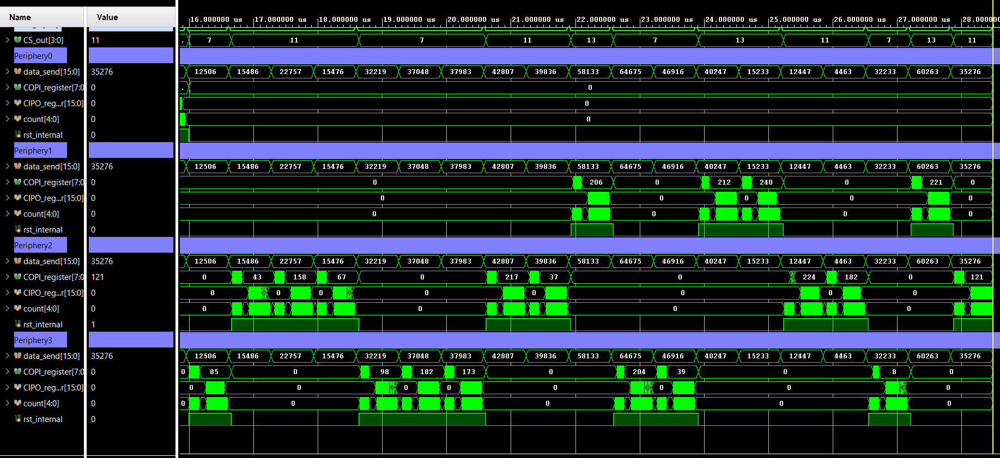
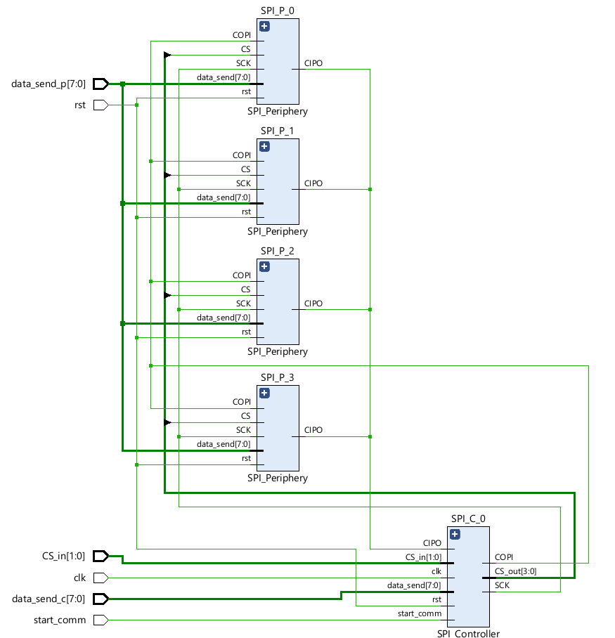

# SPI Protocol Implementation in SystemVerilog

This repository provides a SystemVerilog implementation of the SPI (Serial Peripheral Interface) communication protocol, along with a comprehensive testbench to validate both single- and multi-peripheral configurations.

---

## Overview

The SPI protocol enables synchronous serial communication between a controller (master) and one or more periphery (slave) units. This project includes:

- Parameterizable SPI modules
- Support for single-master, single-periphery, and multi-periphery systems
- Thorough testbench with waveform and terminal output examples

---

## Testbench Description

The testbench covers three main scenarios to demonstrate and verify SPI functionality:

### 1. Single Periphery Communication

- **Setup:** One controller communicates with a single periphery unit (`Periphery_0`, selected when `CS == 2'b00`).
- **Data:** Controller sends 8-bit data; periphery returns 16-bit data.
- **Pause:** A halt of 5 clock cycles is enforced between communication intervals (visible on the `SCK` signal).
- **Tri-state Logic:** Only the selected periphery drives the `CIPO` (MISO) line; others remain in high-impedance (`1'bz`).
- **Verification:** Sent and received data (`data_send_c`, `data_send_p`) are randomly generated and checked against the corresponding registers.

**Waveform Example:**

**Terminal Output:**

---

### 2. Communication Initiation During Active Transfer

- **Purpose:** Verifies that re-triggering the `start_comm` signal during an ongoing transfer does not disrupt communication.
- **Behavior:** A new initiation event is triggered after a random delay (`wait_rand`), ensuring robustness against spurious triggers.

---

### 3. Multiple Periphery Units

- **Setup:** One controller communicates with four periphery units, selected via the `CS_in` signal.
- **Behavior:** Only the selected periphery drives the `CIPO` line; inactive units' `CIPO` lines remain in high-impedance.
- **Verification:** Communication attributes (data length, pause interval) remain consistent with the single-periphery test.

**Waveform Example:**

**Terminal Output:**

---

## Configuration

All communication parameters (data width, pause interval, etc.) are defined as constants in the code and can be easily overridden to suit different requirements.

---

## Reference Diagram

Below is a high-level block diagram of the SPI system as elaborated in Vivado:

---

## Notes

- All signals and data paths are clearly illustrated in the provided waveform images.
- The design supports easy reconfiguration for custom SPI setups.
- For further details, refer to the comments and documentation within the source files.
